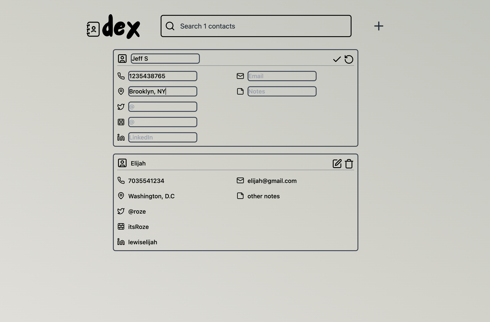

# Dex

Dex (like rolodex) is my custom-built personal contacts manager. I found myself meeting interesting people at various network events and wanted to keep in touch. I'm not much of a LinkedIn person and I have a huge number of contacts on my phone, so I felt a specialized solution was needed.



The frontend is built with SolidJS, the backend in Go and AWS (via SST), and the database is Turso.

If you'd like to fork Dex, go for it but there's a bit of setup and this assumes you have an AWS account.

## Installation

```bash
pnpm i
```

## Setup Database

Setup secrets via `sst secrets` (this defaults to your personal stage). Use `--fallback` to set this as a fallback

```bash
pnpm sst secrets set TURSO_URL <url> --fallback
pnpm sst secrets set TURSO_AUTH_TOKEN <token> --fallback
```

Push schema changes to the database

```bash
pnpm db:push
```

## Running SST

```bash
pnpm sst dev
```

## Run app

```bash
pnpm dev
```

## Remaining

[] Complete search functionality
